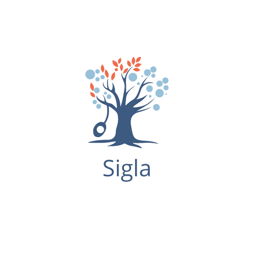

# Sigla

[https://sigla.carrd.co](http://sigla.carrd.co)

Sigla is your personal nutrition tracker for your kids, so you can keep them healthy, growing, and energetic. As all kids should be.

## Features
1. **One-stop BMI + Calorie Calculator** - Input some simple details, and let us do the rest. Have your kid's needed daily calories in a snap using Sigla's algorithm.

2. **Breakdown of needed calories** - Get a detailed breakdown of said calorie count, from ounces of proteins to cups of vegetables, all the way down to that last grain of rice.

3. **Food database** - Know what you need to buy, before you even buy it. Our database provides you with the right choices that'll fill the stomach, but not empty the wallet.

## Installation

1.Go to the `releases` tab of this repository or click this [link](https://github.com/mattalejo/sigla/releases)

2. Click on `v1.0.0`.

3. Click on `sigla-app-armeabi-v7a-release.apk` to download.

## Sustainable Development Goals Tackled
- SDG 2
- SDG 3

## Created by Squirtle Squad
- Matt Alejo
- Raphael Magno
- Diego Manzano
- Carlo Sarrosa
- Golden Sison
